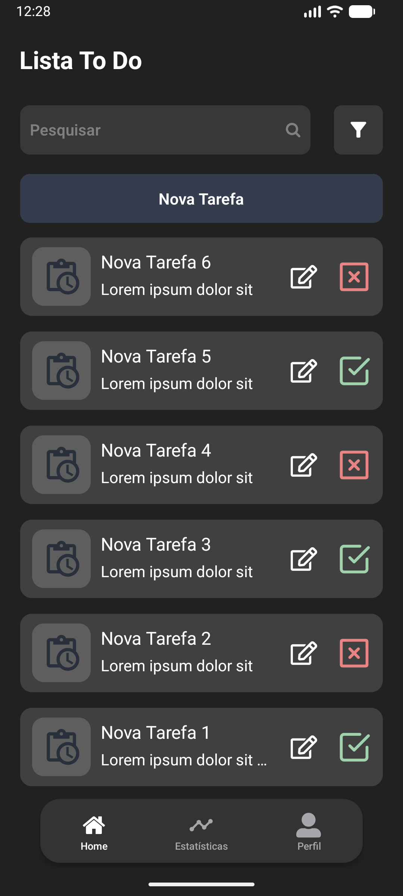
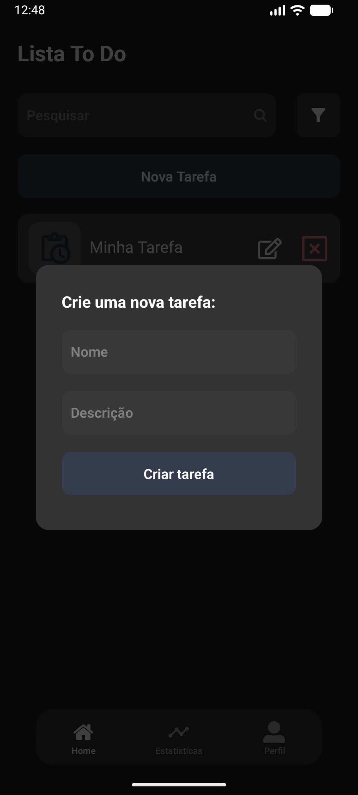
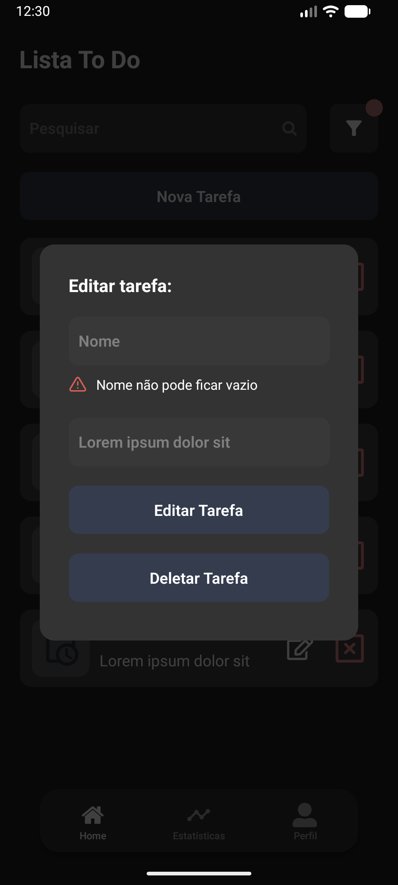
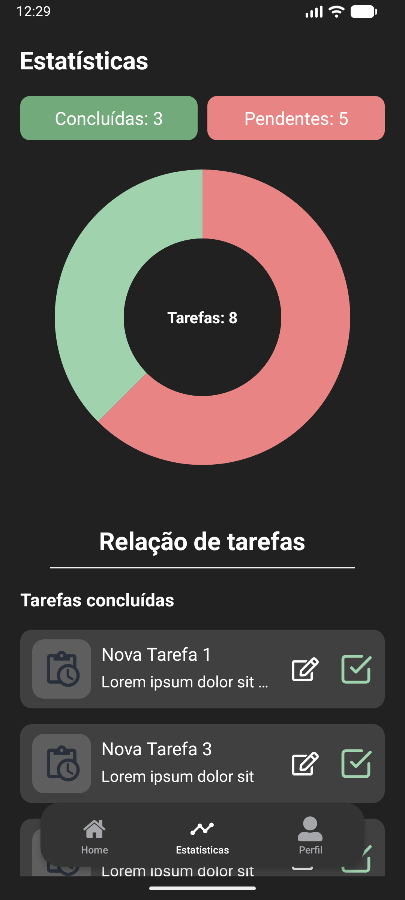
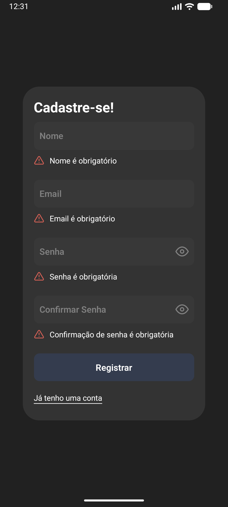
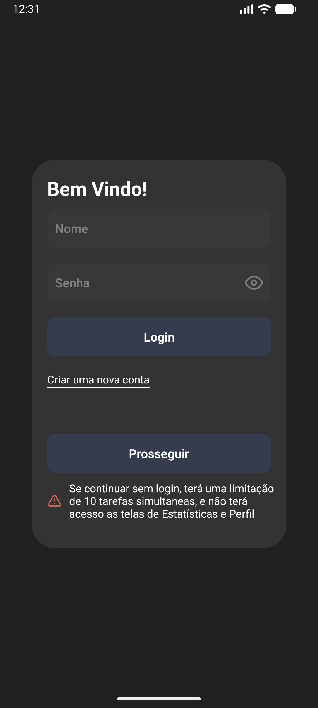

# Todo List

## Sobre o App

App de desafio técnico React Native estilo "To Do List".
O app consiste em um sistema CRUD completo, onde o usuário pode criar tasks, marcar e desmarcar como concluídas, editar nome e/ou descrição, deletar, listar as tasks criadas, além buscar tasks específicas com campo de busca por nome e filtrar por concluídas ou pendentes... Possui também uma tela de estatísticas simples, com gráfico estilo pie chart representando visualmente a proporção de tasks concluídas/pendentes do usuário, e também uma tela simples de perfil onde é mostrado as informações do usuário. O app possui um sistema de persistência local de dados com AsyncStorage, com login e registro, mantendo informações separadas por usuário, garantindo que cada um tenha as suas próprias tasks. O app também permite acessar o sistema sem fazer login, porém com limitações, o usuário entrando como convidado tem um limite de 10 tasks simultâneas, e não tem acesso às telas de estatísticas e de perfil, pedindo que o usuário faça o login para usar o app por completo. Ao logar, se tiver tasks que foram criadas como convidado, o usuário pode transferir as tasks pra si, ou deletar elas se quiser.

<div style="display: flex; gap: 10px; flex-wrap: wrap;">
  

  
  
  

  
  

</div>

## Tecnologias

- React Native + Expo
- TypeScript
- Zustand (gerenciamento de estado)
- React Hook Form + Yup (formulários)
- react-native-gifted-charts (gráfico pie para tela de estatísticas)
- AsyncStorage (persistência local)
- Jest + Testing Library (testes unitários)

## Arquitetura

### Components

- Componentes customizados para a composição da aplicação

### Stores (Zustand)

- `useTaskStore` — estado e operações das tasks (CRUD + persistência)
- `useAuthStore` — autenticação, cadastro, usuários registrados e modo convidado (persistência)
- `useUiModalStore` — visibilidade dos modais (sem persistência, é estado de UI)

### Hooks

- `useFilteredList` — filtragens da lista de tasks, filtro de busca das tasks por usuário, status e texto
- `useCreateTask` — orquestra criação de task com validação
- `useUpdateTask` — orquestra edição e deleção de task
- `useValidate` — regras de validação reutilizáveis
- `useAuth` — submissão de login/register com tratamento de erro
- `useTransfer` — lógica de transferência de tasks do convidado (guest) para o usuário logado
- `useAnalytics` — dados formatados para o gráfico

### Decisões de arquitetura

- **Zustand** foi escolhido por permitir múltiplos stores com responsabilidades separadas, sem boilerplate e com suporte nativo a TypeScript
- **Estado de UI em um store** — `useUiModalStore` abriga estados e controle de visibilidade dos modais no store, para que componentes separados tenham acesso aos modais e seus dados sem prop drilling desnecessária.
- **Autenticação simulada** — o `useAuthStore` opera com Promises para simular autenticação assíncrona; para integração com uma API real
- **Hooks com a lógica para cada etapa do CRUD** — ainda que simples, regras de negócio e lógica para as operações separadas em hooks para manter os componentes (sempre que possível) com sua única responsabilidade
- **Vários componentes** — a ideia foi separar o código em blocos menores, tanto para reaproveitamento, quanto para facilitar a manutenção, legibilidade e organização, deixando cada pedaço de código com sua responsabilidade separada
- **Filtros em memória** — em produção com backend, seriam parâmetros de query na API

## Funcionalidades

- CRUD completo de tasks com nome e descrição
- Persistência de dados local com AsyncStorage
- Autenticação simulada com cadastro e login
- Modo visitante com limite de 10 tasks simultâneas
- Transferência de tasks do visitante para conta logada
- Filtro por status (Concluído/Pendente) e busca por nome
- Telas de Analytics com gráfico e separação por status
- Tela de Perfil com dados do usuário
- Controle de acesso — Analytics e Perfil bloqueados para visitantes

## Como rodar

## Pré-requisitos

- Node.js 18+
- Java JDK 17 (para build Android)
- Android Studio (para emulador ou build Android)

## Instalação

```bash
git clone https://github.com/LucasAmorim1/App-Todo-List-Desafio.git
cd App-Todo-List-Desafio
npm install
# ou
yarn
```

## Rodando o projeto

**Via Expo Go:**

```bash
npm start
# ou
yarn start
```

**(mais simples, da pra rodar no emulador, no terminal já vai ter a opção de rodar no emulador android, e também é possível rodar no celular, com o app do expo go, basta ler o qr code gerado no terminal):**

**Dev build Android (precisa do Android Studio e JDK instalados):**

```bash
npx expo prebuild
npm run android
# ou
yarn android
```

## Testes

```bash
npx jest
```
